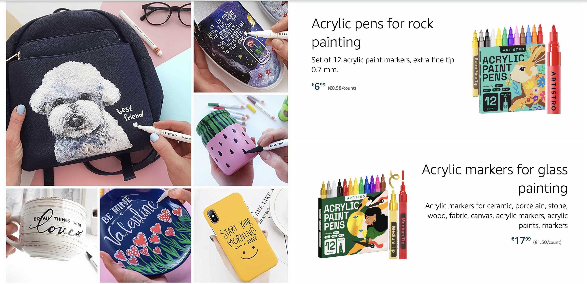
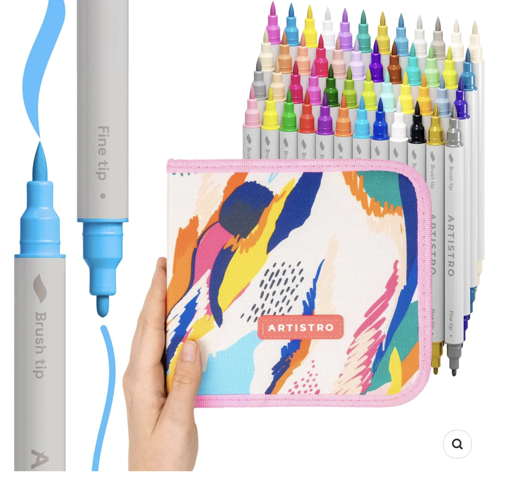
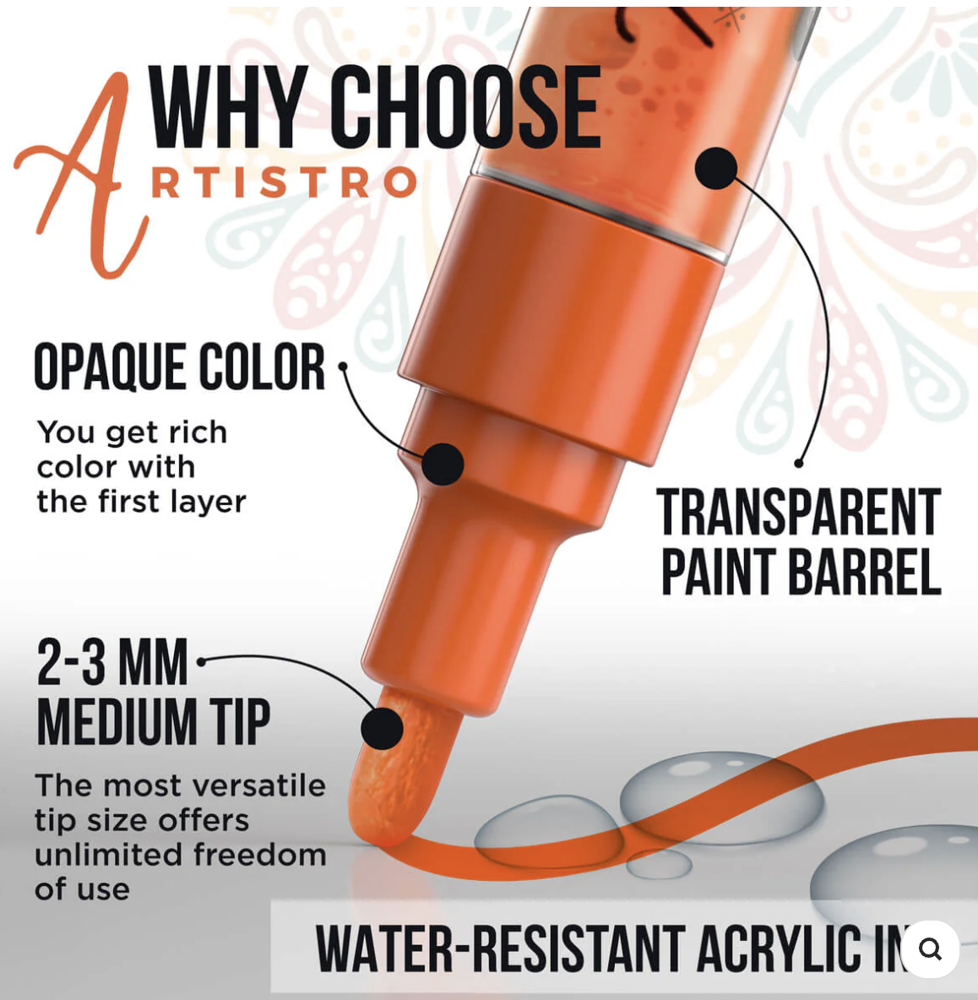
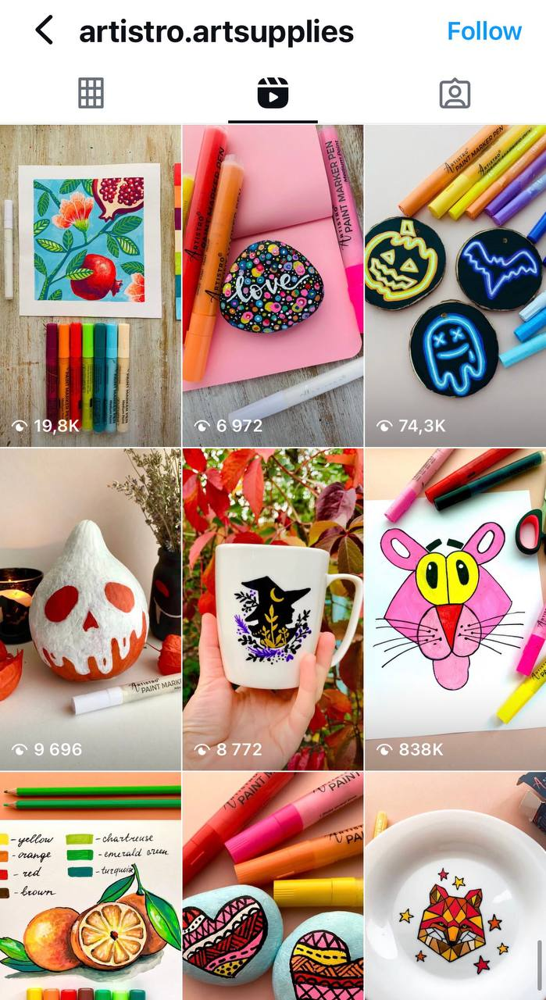
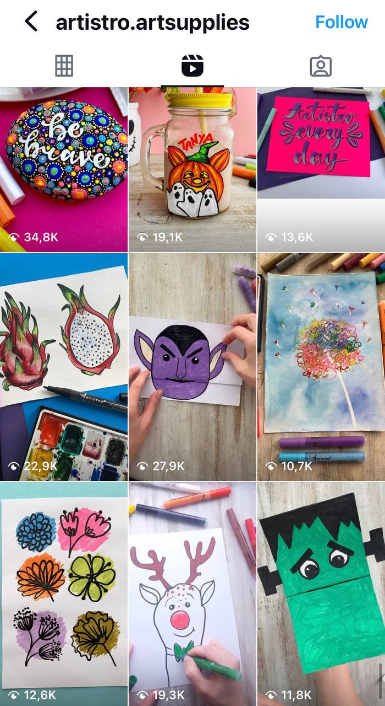
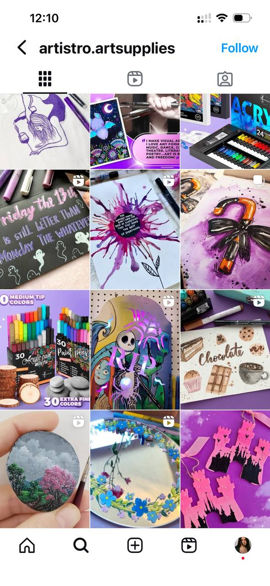
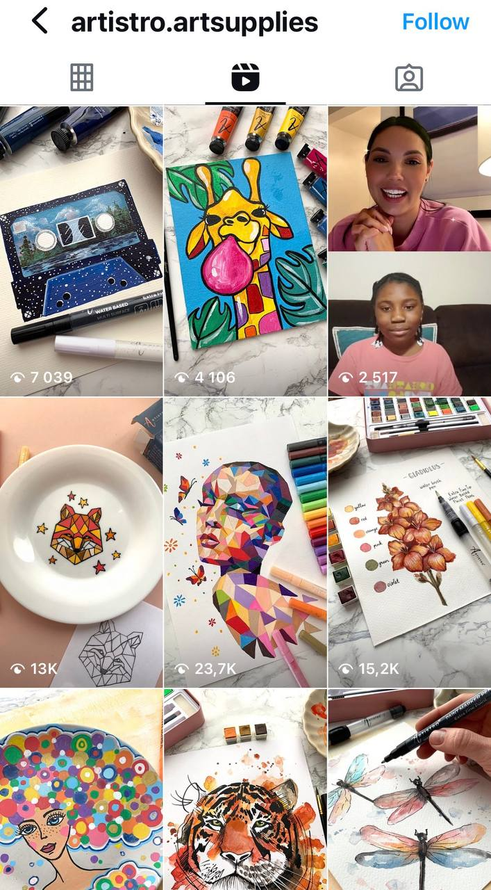

## Project Overview

Instagram growth + website optimization + audience warm-up and engagement mechanics for a US-based art supplies e-commerce brand.

Co-developed social growth strategy, ideated content, coordinated an in-team artist to produce masterclasses, and activated "game mechanics" + collaborations to accelerate reach and conversion.

## Key Results

- **+80,000 followers** - Organic follower growth from viral reach
- **+150% Instagram reach** - Massive increase in content visibility
- **+48% website orders** - Direct impact on e-commerce sales
- **16 sponsorship/ambassador agreements** - Built sustainable influencer network

## My Role

**Digital Marketing Specialist & Content Strategist**

- Developed and executed social media growth strategy
- Coordinated content creation with in-house artist
- Designed engagement mechanics and viral content formats
- Managed influencer collaborations and ambassador program
- Optimized Shopify website for conversion
- Created and managed Instagram/Pinterest content calendar

## Strategy & Execution

### Social Media Growth
- Developed viral content strategy focused on art tutorials and masterclasses
- Created engagement mechanics (challenges, contests, user participation)
- Optimized posting schedule and content formats for maximum reach
- Leveraged Instagram Reels and Stories for algorithm favorability

### Community Building
- Launched ambassador program recruiting 16 content creators
- Developed UGC (User Generated Content) strategy
- Managed ongoing influencer relationships and collaborations
- Built engaged community through consistent interaction

### Conversion Optimization
- Designed and implemented Shopify website banners
- Created clear product photography guidelines
- Optimized product pages for conversion
- Implemented social proof elements (reviews, testimonials)

### Content Production
- Art Coordinator collaboration for tutorial content
- Multi-platform content adaptation (Instagram, Pinterest, Shopify)
- Visual brand consistency across all touchpoints
- Educational content that drives product interest

## Channels

- Instagram (primary growth channel)
- Pinterest (product discovery)
- Shopify (e-commerce platform)
- Email marketing (customer retention)

## Tools & Technologies

- Instagram Ads Manager
- Canva & Adobe Creative Suite
- Shopify
- Social media analytics tools
- Influencer outreach platforms

## Client Type

B2C E-commerce - Arts & Crafts Supplies

## Gallery

### Shopify Banners & E-commerce Design

### Instagram Content System & Layouts

### Pinterest Content Strategy

*This project demonstrates the power of combining viral social media growth with strategic conversion optimization, resulting in both massive audience growth and tangible business results.*
