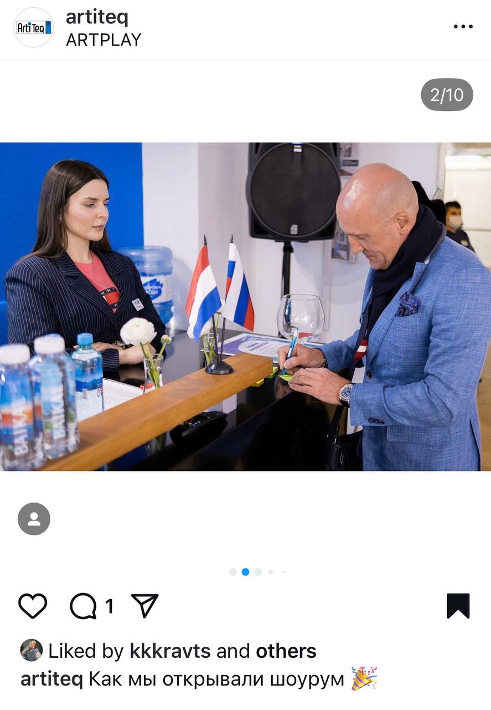
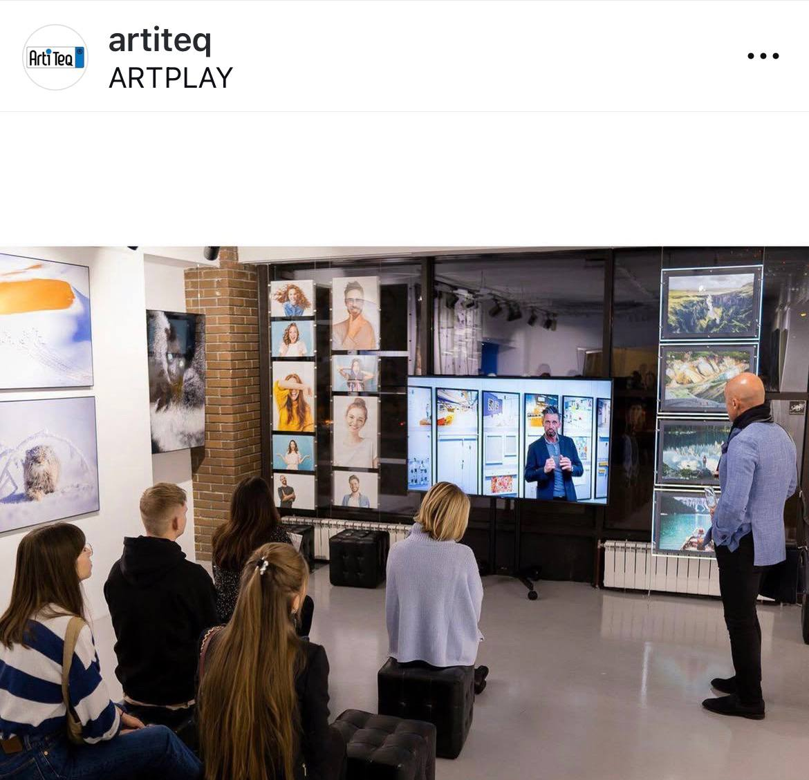
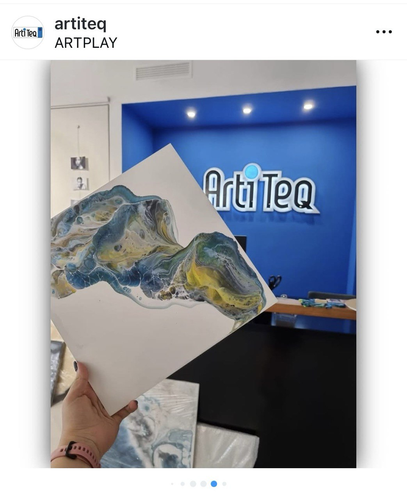
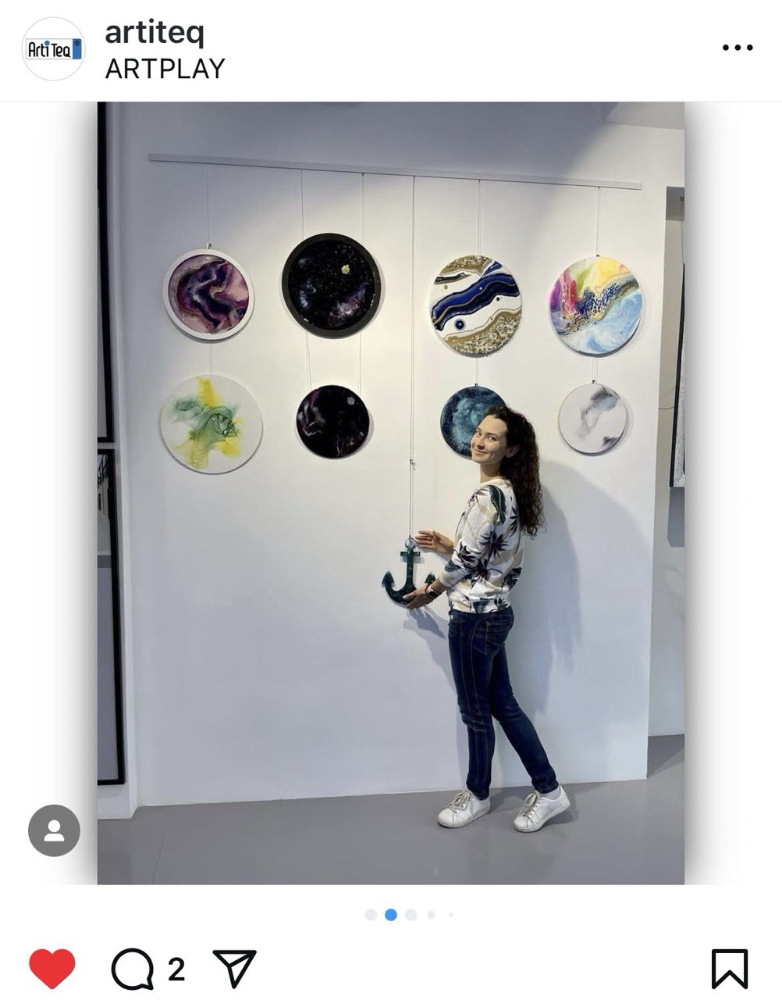
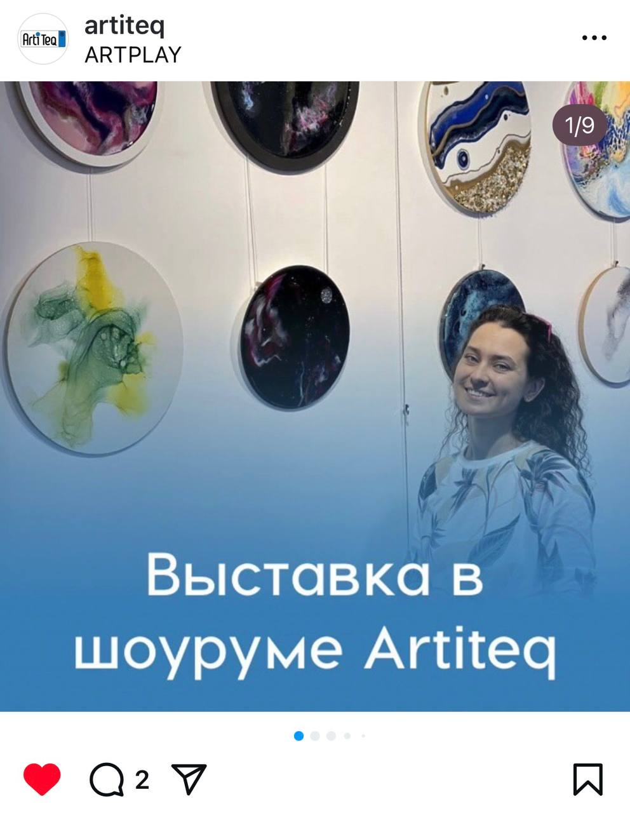
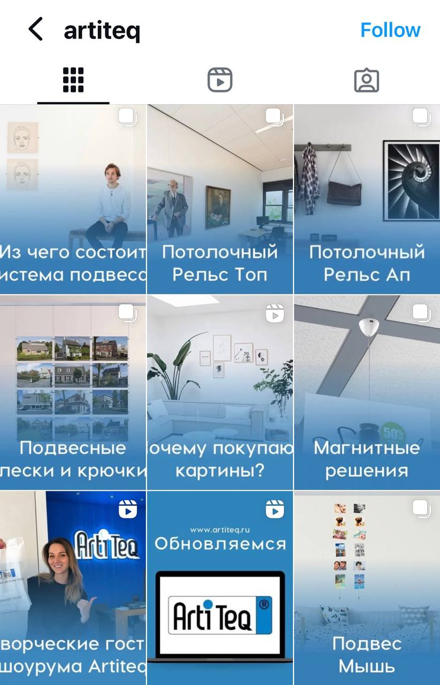
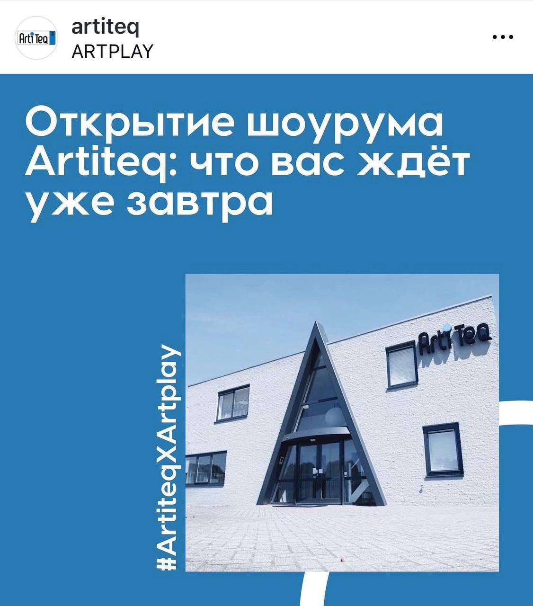

## Project Overview

Planned and produced multi-channel content and supported showroom launch PR/event communications for Artiteq's Rotterdam showroom. The campaign integrated social media, PR, and in-person event elements to drive awareness and client acquisition.

## Key Results

- **60+ new clients** - Direct business impact from launch
- **+40% repeat inquiries** - Strong client retention
- **+2,440 social audience growth** - Significant follower increase
- **6 industry media publications** - Targeted B2B press coverage

## My Role

**Social Media & PR Coordinator**

- Developed social media content strategy for launch
- Created visual content showcasing showroom and products
- Coordinated PR outreach to industry publications
- Supported event planning and execution
- Managed post-launch follow-up communications

## Strategy & Execution

### Social Media Campaign
- Created launch countdown and teaser content
- Produced showroom tour content (photos, videos, stories)
- Engaged with industry professionals and potential clients
- Maintained consistent posting schedule during launch period

### PR & Media Relations
- Developed press releases and media kits
- Secured coverage in 6 B2B industry publications
- Coordinated journalist visits to showroom
- Built relationships with trade media

### Event Support
- Created event promotional materials
- Managed social media live coverage during launch event
- Captured and shared event highlights
- Facilitated networking opportunities

### Content Production
- Professional photography of showroom and products
- Video tours and product demonstrations
- Behind-the-scenes content creation
- Customer testimonials and case studies

## Channels

- Instagram
- Facebook
- LinkedIn (B2B)
- Industry publications
- In-person event

## Tools & Technologies

- Social media management platforms
- PR outreach tools
- Photo/video editing software
- Event management tools

## Client Type

B2B - Picture Hanging Systems for Galleries & Museums

## Gallery

### Showroom Opening Event

### Social Media Assets

---

*This project demonstrates expertise in integrated launch campaigns combining social media, PR, and event marketing for B2B audiences.*
