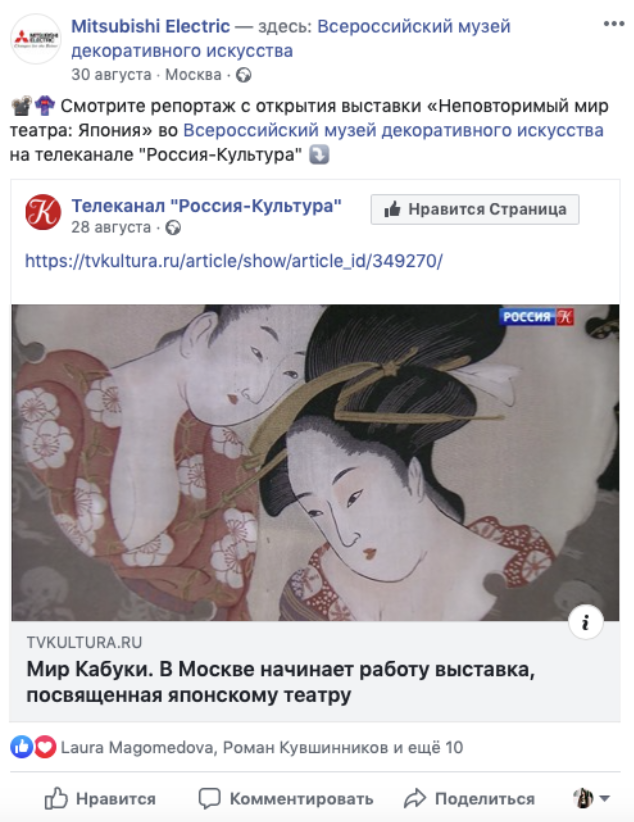
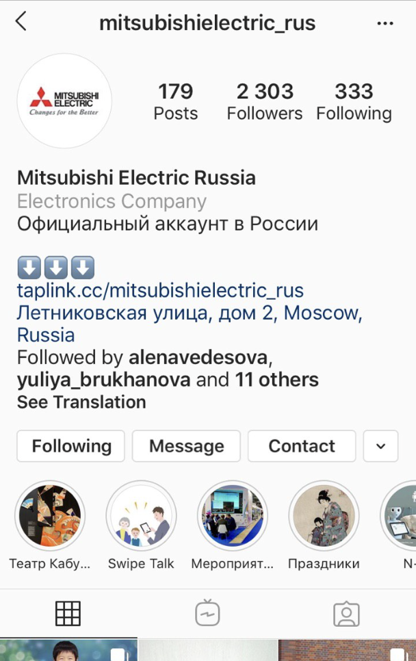
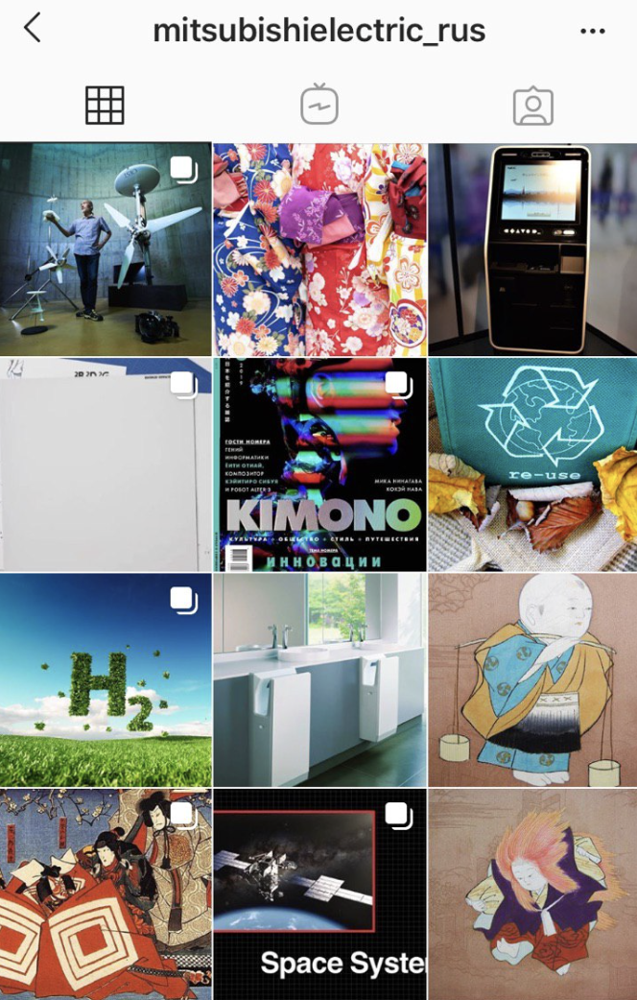
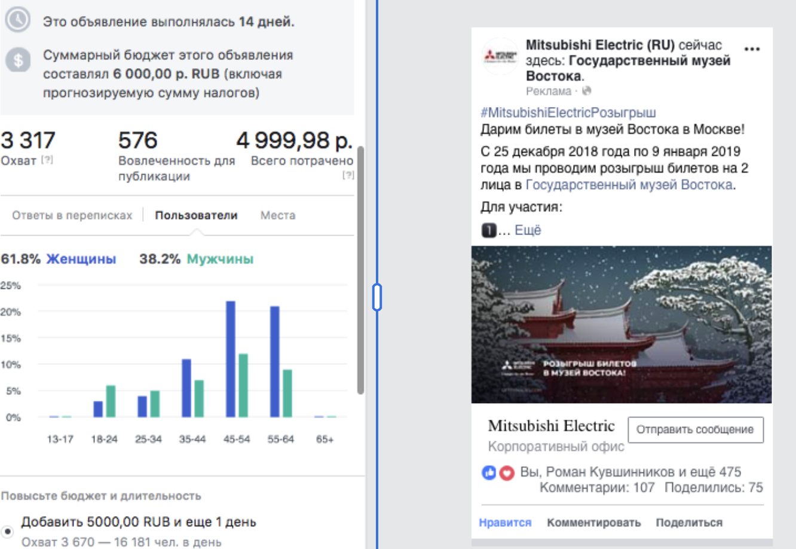
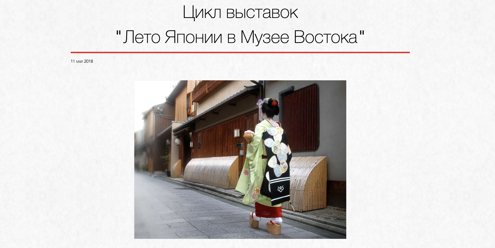
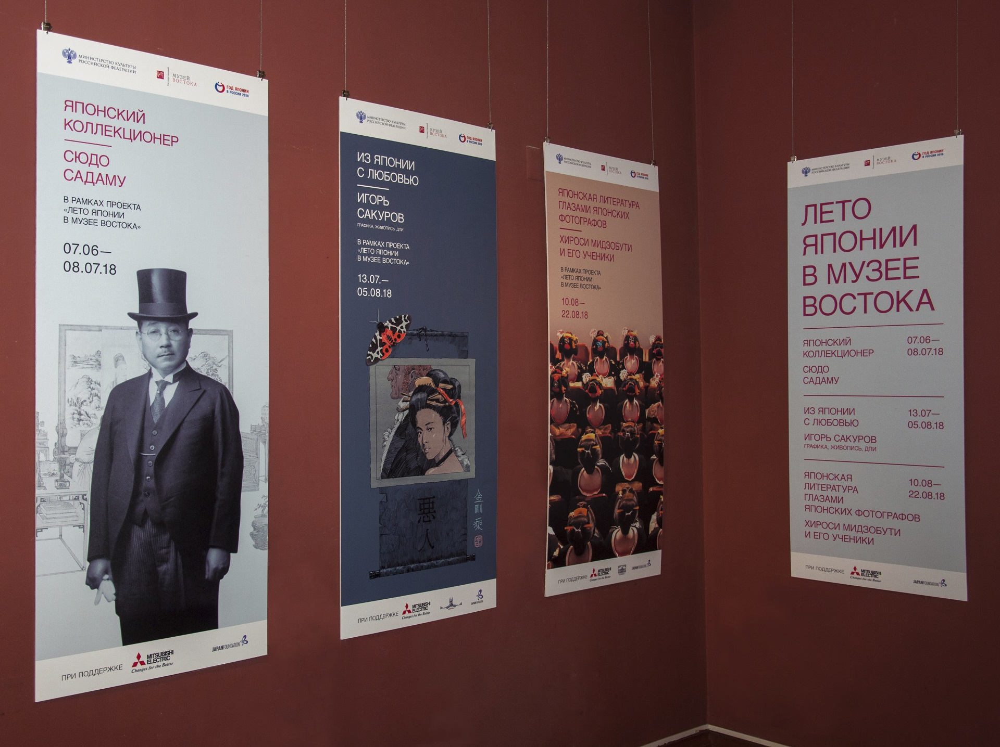
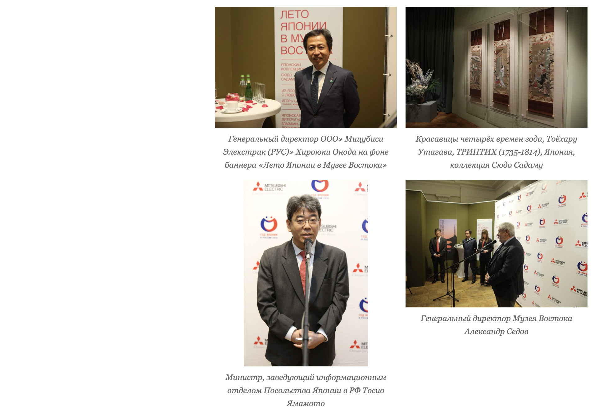

## Project Overview

Supported cross-channel growth and brand visibility for Mitsubishi Electric in Russia via website optimization, Instagram launch, PR initiatives, and cultural partnerships including museum collaborations.

## Key Results

- **+45% website traffic** - Significant increase in online visibility
- **0 → 2,500+ social followers** - Built social presence from scratch in 12 months
- **30+ top-tier media publications** - Extensive PR coverage in quality outlets
- **Major cultural partnerships** - Museum of Oriental Art collaboration

## My Role

**Digital Marketing & PR Coordinator**

- Launched and grew Instagram and Facebook presence
- Coordinated PR campaigns and media relations
- Organized cultural partnership events (e.g., "Japanese Summer" at Museum of Oriental Art)
- Optimized website for SEO and user engagement
- Managed cross-channel marketing campaigns

## Strategy & Execution

### Instagram Launch
- Developed brand voice and content strategy for social media
- Created content calendar featuring products and lifestyle content
- Engaged with community to build authentic following
- Coordinated with product teams for feature highlights

### PR & Media Relations
- Developed PR strategy and press releases
- Built relationships with journalists and media outlets
- Secured coverage in 30+ top-tier publications
- Organized press events and product launches

### Cultural Partnerships
- Conceptualized and executed "Japanese Summer" event at Museum of Oriental Art
- Aligned brand with cultural initiatives
- Created experiential marketing opportunities
- Built brand credibility through association with cultural institutions

### Website Optimization
- Improved site structure and navigation
- Optimized content for search engines
- Enhanced user experience
- Integrated social media for cross-promotion

## Channels

- Instagram
- Facebook
- Website/Blog
- PR/Media
- Cultural Events

## Tools & Technologies

- Instagram/Facebook Ads Manager
- Website CMS
- PR outreach tools
- Analytics platforms

## Client Type

B2C - Consumer Electronics & Technology

## Gallery

### Instagram Launch & Content Examples

### Press & Event Materials

---

*This project showcases the ability to build brand presence from the ground up through integrated digital marketing, social media, and cultural partnerships.*
